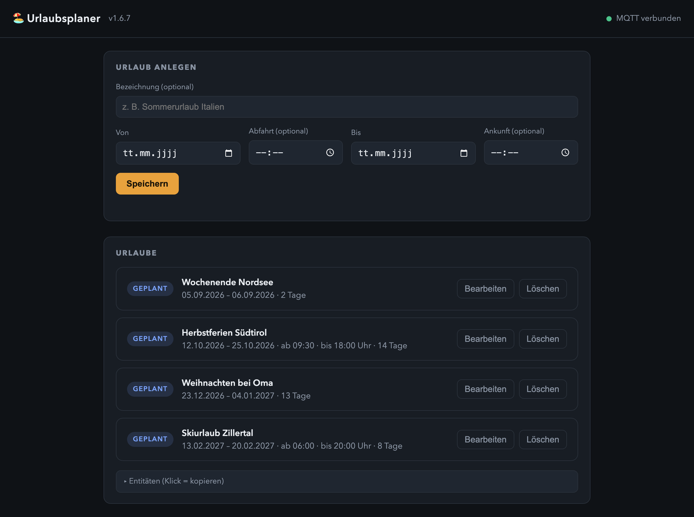
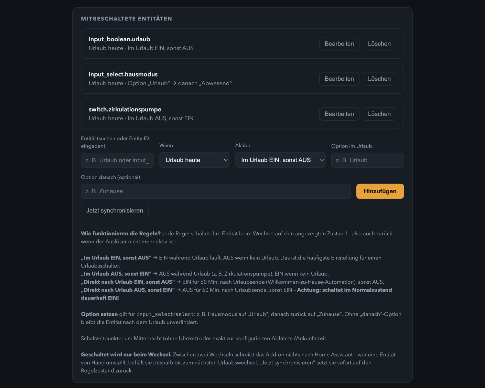
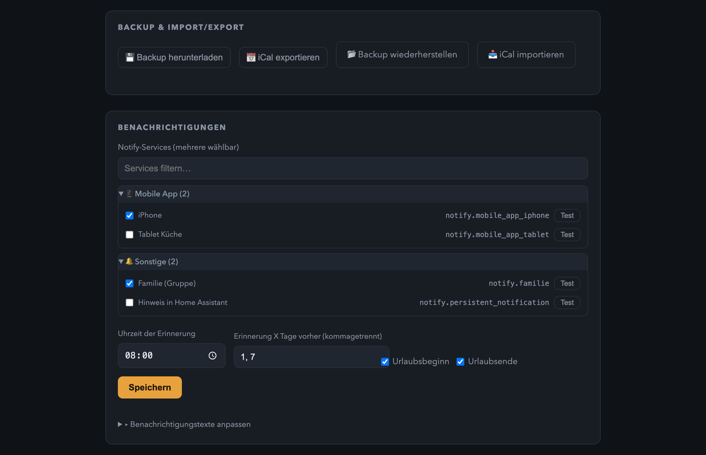

# HA Urlaubsplaner

Home Assistant Add-on-Repository mit dem **Urlaubsplaner**: Urlaubszeiträume bequem über eine eigene Weboberfläche (oder direkt über die Dashboard-Karte) eintragen, bearbeiten und löschen – und als Entitäten in Home Assistant nutzen, z. B. um Automationen im Urlaub anders zu schalten.

[](https://my.home-assistant.io/redirect/supervisor_add_addon_repository/?repository_url=https%3A%2F%2Fgithub.com%2FMelle79%2FHA-urlaubsplaner)

[](https://buymeacoffee.com/melle79)



## Funktionen

- **Web-UI als Ingress-Panel**: Urlaube mit Bezeichnung, Von- und Bis-Datum anlegen – per Kalender-Popup oder manueller Eingabe
- **Mehrere Zeiträume** parallel, jeder Urlaub ist **bearbeitbar und löschbar**
- Entitäten **`Urlaub heute`** und **`Urlaub morgen`** (ein/aus) plus **`Nächster Urlaub`** mit allen Details als Attribute
- **Dashboard-Karte** ([Urlaubsplaner Card](https://github.com/Melle79/HA-urlaubsplaner-card)): Urlaube direkt im Lovelace-Dashboard eintragen, bearbeiten und löschen
- Entitäten via **MQTT Discovery** (retained) mit Availability-Topic – die MQTT-Zugangsdaten holt sich das Add-on automatisch vom Supervisor
- **Entitäten mitschalten**: beliebig viele bestehende Entitäten (z. B. `input_boolean.urlaub`) werden per Regel automatisch geschaltet – je Regel wählbar: Auslöser (Urlaub heute / Urlaub morgen / Urlaub gerade vorbei) und Aktion (im Urlaub einschalten, ausschalten oder bei `input_select`/`select` eine Option setzen, z. B. Hausmodus „Urlaub“ und danach zurück auf „Zuhause“)
- **Geschaltet wird nur beim Wechsel**: Das Add-on wacht zum Urlaubsbeginn und -ende, zum Datumswechsel und zur Benachrichtigungszeit auf, schreibt dabei aber nichts nach Home Assistant, solange sich nichts geändert hat – von Hand umgestellte Entitäten bleiben so stehen
- **Mit oder ohne Uhrzeit**: Zeiträume können auf die Minute genau beginnen und enden (z. B. Abfahrt 12:00, Rückkehr 17:00); ohne Uhrzeit gilt der ganze Tag. Beide Varianten werden intern gleich behandelt und punktgenau geschaltet
- Keine externe API, keine Cloud – alle Daten liegen lokal in `/data` des Add-ons

## Entitäten

| Entität | Typ | Attribute |
|---|---|---|
| Urlaub heute | binary_sensor | `datum`, `bezeichnung`, `beginn`, `ende`, `dauer_tage`, `rest_tage` |
| Urlaub morgen | binary_sensor | `datum`, `bezeichnung`, `beginn`, `ende`, `dauer_tage`, `rest_tage` |
| Urlaub gerade vorbei | binary_sensor | `datum`, `bezeichnung`, `ende`, `vor_minuten` (ON für 60 Min. nach Urlaubsende) |
| Nächster Urlaub | sensor | `bezeichnung`, `beginn`, `ende`, `in_tagen`, `dauer_tage`, `aktuell_urlaub`, `urlaube` (alle Zeiträume), `vorschau` (14-Tage-Streifen) |

Entity-IDs: `binary_sensor.urlaub_heute`, `binary_sensor.urlaub_morgen`, `binary_sensor.urlaub_gerade_vorbei`, `sensor.naechster_urlaub`.

State des Sensors „Nächster Urlaub": `Läuft` (Urlaub aktiv), das Beginn-Datum des nächsten Urlaubs (ISO) oder `Keiner geplant`.

### Beispiel-Automation

```yaml
automation:
  - alias: "Heizung im Urlaub absenken"
    triggers:
      - trigger: state
        entity_id: binary_sensor.urlaub_heute
        to: "on"
    actions:
      - action: climate.set_temperature
        target:
          entity_id: climate.wohnzimmer
        data:
          temperature: 17
```

## Screenshots

**Mitgeschaltete Entitäten** – Regeln legen fest, welche Entität beim Urlaubswechsel wie geschaltet wird.
Geschaltet wird nur beim Wechsel; „Jetzt synchronisieren" setzt alle Regeln sofort auf ihren Sollzustand.



**Benachrichtigungen** – Erinnerung mit Vorlauf, zur Uhrzeit deiner Wahl, an beliebige `notify.*`-Dienste.
Backup und iCal-Export liegen gleich darüber.



## Voraussetzungen

- Home Assistant Core **2025.10 oder neuer** (Discovery nutzt `default_entity_id`)
- MQTT-Broker (z. B. das offizielle **Mosquitto broker** Add-on) und die MQTT-Integration in Home Assistant. Die Zugangsdaten holt sich das Add-on automatisch vom Supervisor.

## Installation

1. Badge oben anklicken **oder** unter *Einstellungen → Add-ons → Add-on Store → ⋮ → Repositories* diese URL hinzufügen:
   `https://github.com/Melle79/HA-urlaubsplaner`
2. **Urlaubsplaner** installieren und starten.
3. Panel **„Urlaub"** in der Sidebar öffnen und Urlaube eintragen.

## Dashboard-Karte

Die Karte ist **im Add-on enthalten** – eine getrennte Installation über HACS ist nicht nötig.
Beim Start legt das Add-on `urlaubsplaner-card.js` nach `www/` deiner Home-Assistant-Konfiguration
und trägt sie als Lovelace-Ressource ein. Damit sind Karte und Add-on immer versionsgleich.

Danach genügt eine manuelle Karte im Dashboard:

```yaml
type: custom:urlaubsplaner-card
title: Urlaub
```

Sie zeigt Status-Badges (Heute / Morgen / Gerade vorbei), den 14-Tage-Streifen, den nächsten Urlaub
und die komplette Liste. Urlaube lassen sich **direkt in der Karte** anlegen, bearbeiten und löschen;
die Änderungen gehen per `mqtt.publish` an das Topic `urlaubsplaner/cmd`.

> **Umstieg von der HACS-Karte:** Solange die Karte noch über HACS eingebunden ist, hält sich das
> Add-on zurück und legt **keine** zweite Ressource an – zwei Registrierungen desselben Elements
> würden das Dashboard stören. Deinstalliere dazu „Urlaubsplaner Card" in HACS und entferne die
> Ressource `/hacsfiles/HA-urlaubsplaner-card/…` unter *Einstellungen → Dashboards → ⋮ → Ressourcen*.
> Beim nächsten Add-on-Start übernimmt das Add-on. Ein entsprechender Hinweis steht im Add-on-Protokoll.

## Technik

- Backend: Python 3 / Flask im Add-on-Container, Persistenz als JSON unter `/data/urlaube.json`
- Entitäten via MQTT Discovery (retained, QoS 1, Availability-Topic `urlaubsplaner/availability`)
- Die Dashboard-Karte sendet Änderungen über den HA-Service `mqtt.publish` an das Command-Topic `urlaubsplaner/cmd` – das Add-on verarbeitet sie und publiziert sofort die neuen Zustände

## Lizenz

MIT – siehe [LICENSE](LICENSE).

## Haftungsausschluss

Dies ist ein **privates Hobby-Projekt** ohne kommerziellen Hintergrund. Die Nutzung erfolgt auf eigene Gefahr – **jegliche Haftung ist ausgeschlossen** (siehe auch MIT-Lizenz). Es findet **kein Support** statt; Issues und Pull Requests werden möglicherweise nicht beantwortet.
